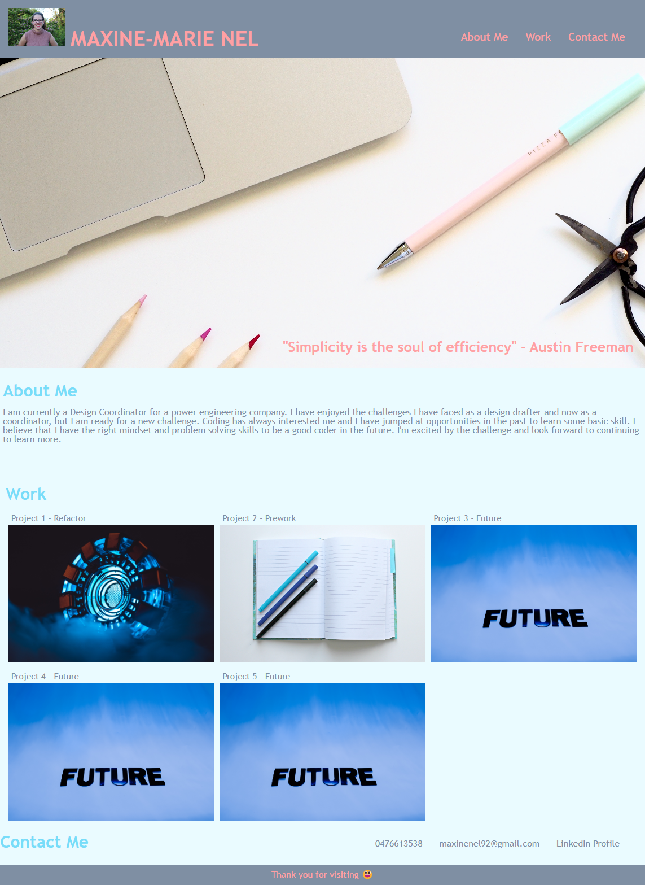

# Portfolio-Maxine-Nel

## Created an HTML file.

1. An HTML was structured to show my full profile.
2. Website has a unique name.
3. There is a heading, main and footer section.
4. Images were incorpated.
5. Hyperlinks were used to visit previous pages.
6. Webpage is respnsive where nescessary.

## Created a CSS file.

1. Styling was added. Fonts, fonts-size, color and positioning.

## Completed Webpage

## Link to website

1. GitHub Repository: https://github.com/Maxie92/Portfolio-Maxine-Nel
2. Website: https://Maxie92.github.io/Portfolio-Maxine-Nel/

